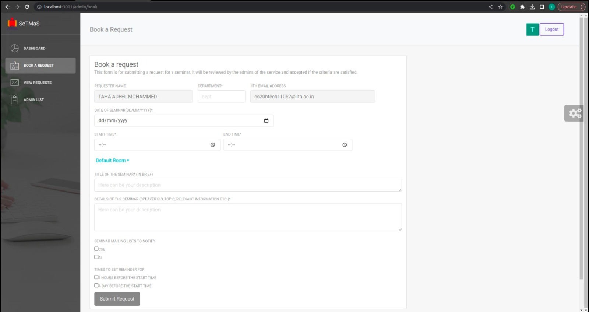

# SeTMaS

## Table of Contents
<ol>
    <li>
        <a href="#description">Description</a>
    </li>
    <li>
        <a href="#build">Build</a>
    </li>
    <li>
        <a href="#license">License</a>
    </li>
</ol>

## Description
SeTMaS is an innovative application that streamlines the organization of events in educational institutions by automating the request processing and approval process. With its user-friendly interface and powerful features, SETMaS simplifies the task of managing events, saves valuable time, and significantly reduces the administrative burden on the institution.

This project was done as a part of the SWE course in the sixth semester at IIT Hyderabad.

## Build 
* To install all the required dependencies and launch the application<br />
```  make all```
* To clean up the project directory and remove all the build artifacts and dependancies<br />
```  make clean```

## License
 This project is done under the MIT License. See [LICENSE](LICENSE) for more information.